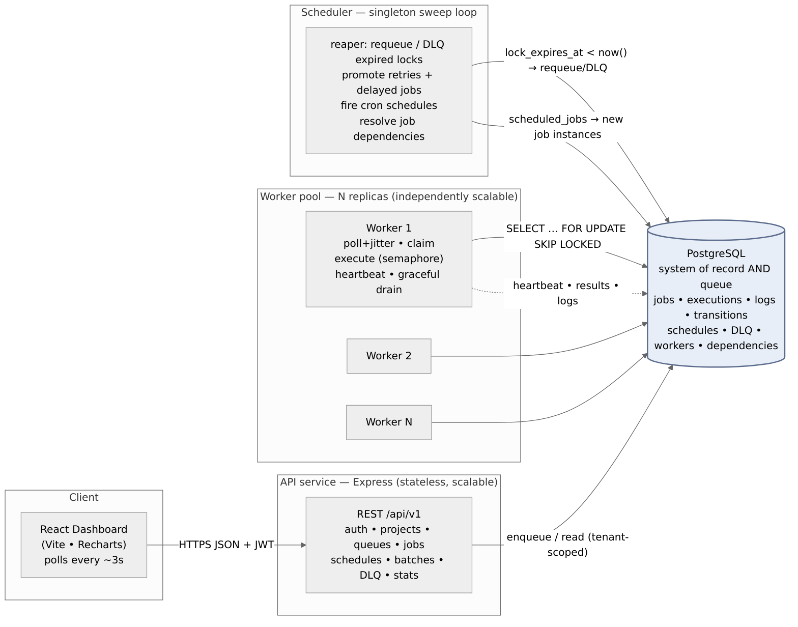
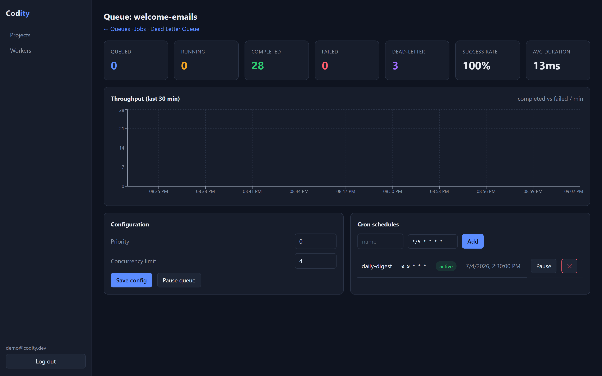
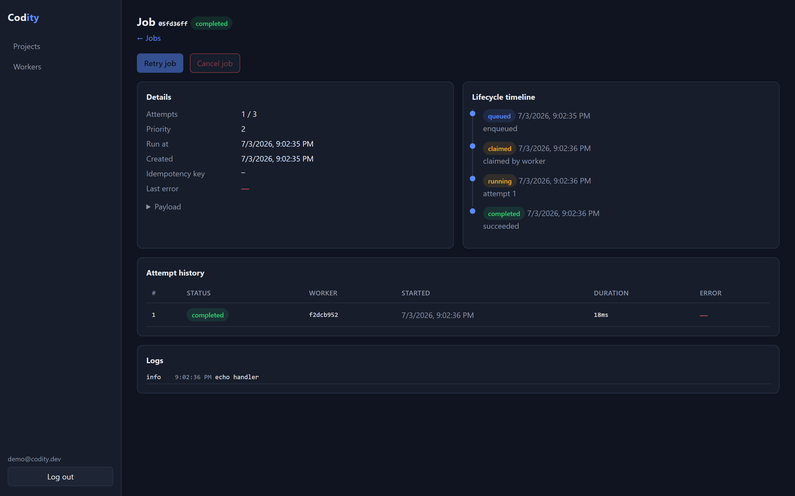
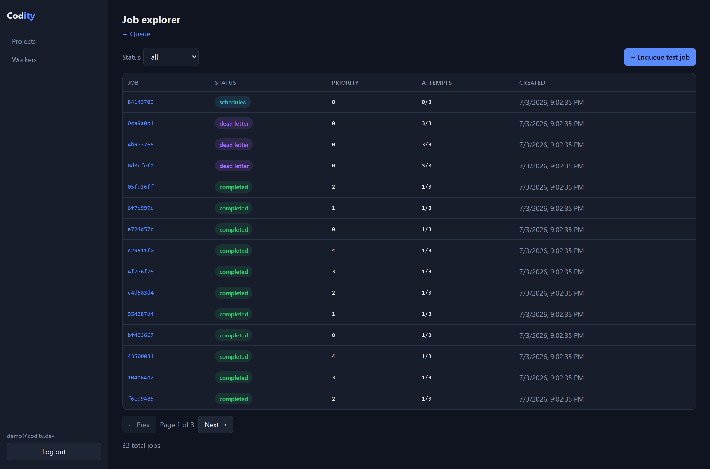
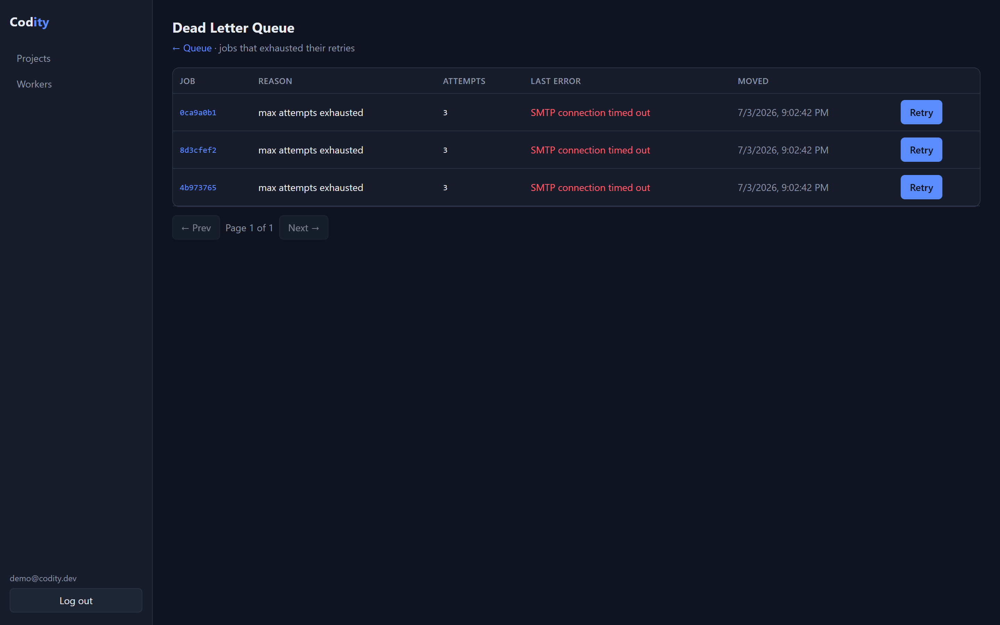

# Codity — Distributed Job Scheduling Platform

A production-inspired job scheduler built on **Node.js + TypeScript + PostgreSQL**, where
Postgres is both the system of record and the queue. Jobs are claimed atomically by a pool
of horizontally-scalable workers using `SELECT ... FOR UPDATE SKIP LOCKED`, retried with
configurable backoff, dead-lettered on exhaustion, and fully observable (per-attempt
history, logs, lifecycle audit).

> **Status:** complete — 8 phases, one commit each. **63 automated tests** (real dockerized
> Postgres). Full stack runs with `docker compose up -d --build`.
>
> **Key docs:** [DESIGN.md](./DESIGN.md) (decisions & trade-offs) ·
> [deliverables/](./deliverables/DELIVERABLES.md) (diagrams, OpenAPI, index) ·
> API reference at `GET /docs` (Swagger UI).

## Architecture & schema



Three independently scalable services over one Postgres (system of record **and** queue).
Full-resolution + ER diagram: [docs/architecture.md](./docs/architecture.md) ·
[docs/er-diagram.md](./docs/er-diagram.md) · downloadable SVG/PNG in
[deliverables/](./deliverables).

## Dashboard

The React dashboard runs locally at **http://localhost:5173** (`docker compose up -d --build`,
or `npm run dev -w @codity/frontend`). It polls every ~3s for live updates.

| Queue health & throughput | Job lifecycle, attempts & logs |
| --- | --- |
|  |  |
| **Job explorer** (filter + paginate) | **Dead Letter Queue** (one-click retry) |
|  |  |

More screens (queues list, workers, projects, login) in
[deliverables/screenshots/](./deliverables/screenshots).

## Repository layout

```
packages/
  db/          # pg connection pool + node-pg-migrate migrations (the schema)
  shared/      # env config (zod), pino logger, graceful shutdown
  core/        # data-access layer: enqueue, the claim query, lifecycle, reaper
  worker/      # worker engine: poll/claim/execute/heartbeat/graceful shutdown
  scheduler/   # singleton sweep loop: reaper + retry/delayed/cron promotion
  api/         # Express REST API: auth, projects, queues, jobs, OpenAPI
frontend/      # React + Vite + Recharts dashboard (auth, queues, jobs, workers, DLQ)
docs/          # architecture + ER diagrams
scripts/       # demo-seed.ts and other dev utilities
```

## Run the worker & scheduler

```bash
npm run migrate:up                       # ensure schema exists

# Option A — via Docker (whole stack):
docker compose up -d --build worker scheduler
docker compose up -d --scale worker=3 worker   # scale workers horizontally

# Option B — locally (each in its own terminal):
npm start -w @codity/worker
npm start -w @codity/scheduler

# Enqueue some demo work and watch it get processed:
COUNT=20 npx tsx scripts/demo-seed.ts
```

The worker polls all non-paused queues (priority-ordered) unless `WORKER_QUEUES` is set,
runs up to `WORKER_CONCURRENCY` jobs at once, heartbeats to hold its job locks, and drains
in-flight jobs on `docker stop` / SIGTERM. The scheduler runs the reaper that requeues jobs
from crashed workers.

## Run the API

```bash
npm run migrate:up
npm start -w @codity/api          # or: docker compose up -d --build api
# API on http://localhost:4000 — Swagger UI at http://localhost:4000/docs
```

Quick end-to-end via HTTP:

```bash
# Sign up (returns accessToken + refreshToken)
curl -sX POST localhost:4000/api/v1/auth/signup -H 'Content-Type: application/json' \
  -d '{"email":"me@ex.com","password":"password123","organizationName":"Acme"}'

# Use the token for everything else:
TOKEN=...        # accessToken from the response
curl -sX POST localhost:4000/api/v1/projects -H "Authorization: Bearer $TOKEN" \
  -H 'Content-Type: application/json' -d '{"name":"my-project"}'
```

All `/api/v1` routes except `/auth/*` require `Authorization: Bearer <accessToken>`, and
resources are isolated per organization. Full endpoint reference is at `/docs`.

## Run the dashboard

```bash
npm start -w @codity/api                 # API must be running (CORS is enabled)
npm run dev -w @codity/frontend          # Vite dev server on http://localhost:5173
# or the whole stack in Docker:
docker compose up -d --build             # dashboard at http://localhost:5173
```

Sign up in the UI, create a project → queue, enqueue jobs, and start a worker
(`npm start -w @codity/worker`) to watch them flow through in real time. The dashboard
polls every ~3s and provides: queue health at a glance, a job explorer (filter by status,
paginated), a job detail view (lifecycle timeline, per-attempt history, logs), worker fleet
status, the Dead Letter Queue with one-click retry, queue config (priority / concurrency /
pause-resume), cron schedule management, and a live throughput chart.

The browser calls the API directly at `VITE_API_URL` (default `http://localhost:4000`).

## Prerequisites

- Node.js ≥ 20 and npm ≥ 10
- Docker + Docker Compose (for Postgres, and later the full stack)

## Setup

```bash
# 1. Install dependencies (npm workspaces)
npm install

# 2. Create your env file
cp .env.example .env

# 3. Start Postgres
npm run db:up          # docker compose up -d postgres

# 4. Apply the schema
npm run migrate:up
```

Postgres listens on `localhost:5432` (`codity` / `codity` / db `codity`). Adminer, a web DB
browser, is available at http://localhost:8080 once `docker compose up` is running.

## Migration commands

| Command | Effect |
| --- | --- |
| `npm run migrate:up` | Apply all pending migrations. |
| `npm run migrate:down` | Roll back the most recent migration. |
| `node packages/db/scripts/migrate.mjs down <n>` | Roll back `n` migrations. |
| `node packages/db/scripts/migrate.mjs redo` | Roll back one and re-apply it. |

## Verify Phase 1

```bash
# 16 tables expected (15 domain + pgmigrations)
docker exec codity-postgres psql -U codity -d codity -c "\dt"

# The all-important partial claim index should be present
docker exec codity-postgres psql -U codity -d codity \
  -c "SELECT indexname, indexdef FROM pg_indexes WHERE tablename='jobs';"

# Prove reversibility: roll everything back and re-apply
node packages/db/scripts/migrate.mjs down 8
npm run migrate:up
```

## Run the tests

The suite runs against **real Postgres** (the brief requires it — not mocks). Vitest's
global setup auto-creates and migrates an isolated `codity_test` database, so you only need
the Postgres container running.

```bash
npm run db:up        # Postgres must be up
npm test             # vitest run
```

Phase 2 ships 13 tests including the grade-critical concurrency proofs:

- `test/claim.concurrency.test.ts` — 500 jobs, 24 concurrent claimers → **each job claimed exactly once** (zero duplicates, none lost).
- `test/concurrency-limit.test.ts` — the per-queue concurrency cap is never exceeded under 20 concurrent claimers.
- `test/skip-locked.test.ts` — `FOR UPDATE SKIP LOCKED` skips a locked row instead of blocking.
- `test/reaper.test.ts` — a job whose worker "died" mid-execution is requeued; a job with a fresh heartbeat is not.
- `test/lifecycle.test.ts` — full state-machine trail, execution/audit rows, idempotency, batch enqueue.
- `test/retry.unit.test.ts` — fixed/linear/exponential backoff math, cap, and equal-jitter bounds.
- `test/retry-dlq.test.ts` — retry-with-backoff → attempts exhausted → **Dead Letter Queue**, reaper dead-lettering, and DLQ list + manual retry over HTTP.
- `test/scheduling.test.ts` — cron next-run math, delayed-job promotion, cron firing (+ no double-fire), and batch rollup, plus the schedule/batch API.
- `test/dependencies.test.ts` — workflow dependencies (blocked → queued on parent completion, cancel on parent failure, wait-for-all).
- `test/rate-limit.test.ts` — per-queue rate limiting enforced in the claim path.
- `test/rbac.test.ts` — role-based access control (members can't mutate config; owner/admin invites).

## Teardown

```bash
npm run db:down        # stop containers
docker compose down -v # also drop the Postgres volume (wipes data)
```
