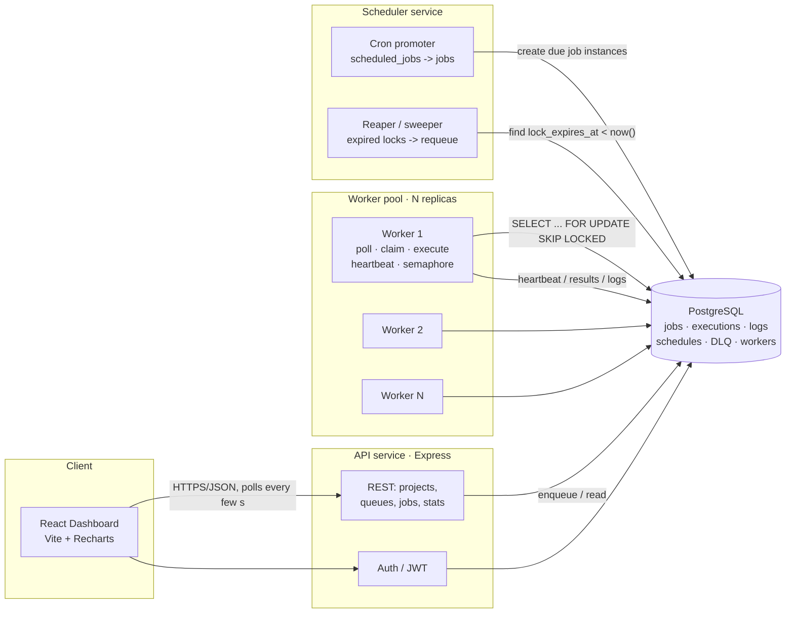

# Architecture

Codity is a Postgres-backed distributed job scheduler. Three independently scalable Node
services share one Postgres database and a `@codity/*` code core. Postgres is the single
source of truth **and** the queue.

## Responsibilities

- **API** — auth, tenant-scoped CRUD for projects/queues/jobs, job submission (immediate/
  delayed/scheduled/cron/batch), stats endpoints for the dashboard. Never executes jobs.
- **Worker** (scale horizontally) — polls its queues with jitter, atomically claims jobs
  via `FOR UPDATE SKIP LOCKED`, respects per-queue concurrency limits, executes jobs
  concurrently under an in-process semaphore, heartbeats to extend the job lock, and shuts
  down gracefully (drain in-flight, then exit).
- **Scheduler** — (1) promotes due `scheduled_jobs` (cron) into concrete `jobs`; (2) runs
  the **reaper**, requeuing jobs whose `lock_expires_at` has passed (crash recovery) and
  marking silent workers dead.
- **Postgres** — durable state, the queue itself, and all history/observability.

## Why the reaper lives in the scheduler

The reaper and cron promoter are both singleton, low-frequency sweep loops that must not be
duplicated across the horizontally-scaled workers (running N reapers would be wasteful and
racy). Housing them in a single scheduler process keeps "exactly-one sweeper" simple. (At
larger scale this becomes a leader-elected job; see DESIGN.md.)

> Data model: see [er-diagram.md](./er-diagram.md). Engineering decisions: see
> [../DESIGN.md](../DESIGN.md).
