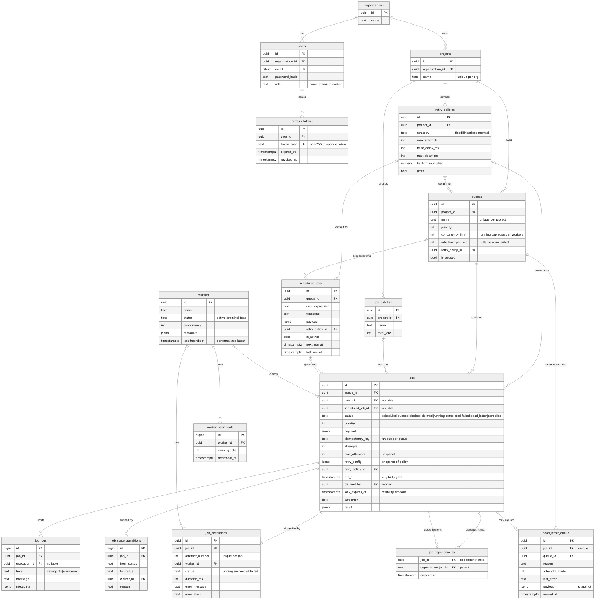

# Entity–Relationship Diagram

Full schema (all 10 migrations applied — 16 domain tables). Rendered from the actual
migrations in [`packages/db/migrations`](../packages/db/migrations).

> Downloadable: [er-diagram.svg](../deliverables/er-diagram.svg) ·
> [er-diagram.png](../deliverables/er-diagram.png) · source
> [er-diagram.mmd](./er-diagram.mmd)

## Notes

- **Ownership tree** (`organizations → projects → queues → jobs`) cascades on delete;
  cross-links (`retry_policy_id`, `batch_id`, `scheduled_job_id`, `claimed_by`) use
  `SET NULL` so history survives losing an optional parent. Rationale + trade-offs in
  [DESIGN.md §1.4](../DESIGN.md).
- **`jobs`** is the core table; the partial index
  `idx_jobs_claim (queue_id, priority DESC, run_at, created_at) WHERE status='queued'`
  backs the claim query.
- **`job_executions`** is one row per attempt (the retry history);
  **`job_state_transitions`** is the full lifecycle audit; **`dead_letter_queue`** snapshots
  dead jobs.
- **`job_dependencies`** is the workflow DAG edge list (child → parent); a job with unmet
  parents sits in status `blocked` until the scheduler promotes it.
