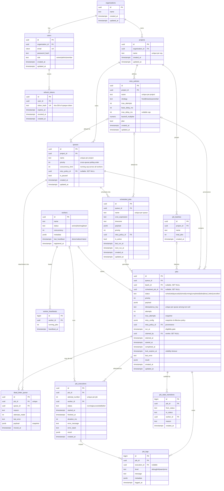

# Entity–Relationship Diagram

Full schema as of Phase 1 (all 8 migrations applied). Rendered from the actual
migrations in [`packages/db/migrations`](../packages/db/migrations).

```mermaid
erDiagram
    organizations ||--o{ users : "has"
    organizations ||--o{ projects : "owns"
    users ||--o{ refresh_tokens : "issues"

    projects ||--o{ queues : "owns"
    projects ||--o{ retry_policies : "defines"
    projects ||--o{ job_batches : "groups"

    retry_policies |o--o{ queues : "default for"
    retry_policies |o--o{ scheduled_jobs : "default for"
    retry_policies |o--o{ jobs : "provenance"

    queues ||--o{ jobs : "contains"
    queues ||--o{ scheduled_jobs : "schedules into"
    queues ||--o{ dead_letter_queue : "dead-letters into"

    job_batches |o--o{ jobs : "batches"
    scheduled_jobs |o--o{ jobs : "generates"

    jobs ||--o{ job_executions : "attempted by"
    jobs ||--o{ job_logs : "emits"
    jobs ||--o{ job_state_transitions : "audited by"
    jobs ||--o| dead_letter_queue : "may die into"

    workers ||--o{ worker_heartbeats : "beats"
    workers |o--o{ jobs : "claims"
    workers |o--o{ job_executions : "runs"

    job_executions |o--o{ job_logs : "scopes"

    organizations {
        uuid id PK
        text name
        timestamptz created_at
        timestamptz updated_at
    }
    users {
        uuid id PK
        uuid organization_id FK
        citext email UK
        text password_hash
        text role "owner|admin|member"
        timestamptz created_at
        timestamptz updated_at
    }
    refresh_tokens {
        uuid id PK
        uuid user_id FK
        text token_hash UK "sha-256 of opaque token"
        timestamptz expires_at
        timestamptz revoked_at
        timestamptz created_at
    }
    projects {
        uuid id PK
        uuid organization_id FK
        text name "unique per org"
        timestamptz created_at
        timestamptz updated_at
    }
    retry_policies {
        uuid id PK
        uuid project_id FK
        text name "unique per project"
        text strategy "fixed|linear|exponential"
        int max_attempts
        int base_delay_ms
        int max_delay_ms "nullable cap"
        numeric backoff_multiplier
        bool jitter
        timestamptz created_at
        timestamptz updated_at
    }
    queues {
        uuid id PK
        uuid project_id FK
        text name "unique per project"
        int priority "cross-queue polling order"
        int concurrency_limit "running cap across all workers"
        uuid retry_policy_id FK "nullable, SET NULL"
        bool is_paused
        timestamptz created_at
        timestamptz updated_at
    }
    workers {
        uuid id PK
        text name
        text status "active|draining|dead"
        int concurrency
        jsonb metadata
        timestamptz last_heartbeat "denormalized latest"
        timestamptz registered_at
    }
    worker_heartbeats {
        bigint id PK
        uuid worker_id FK
        int running_jobs
        timestamptz heartbeat_at
    }
    job_batches {
        uuid id PK
        uuid project_id FK
        text name
        int total_jobs
        timestamptz created_at
    }
    scheduled_jobs {
        uuid id PK
        uuid queue_id FK
        text name "unique per queue"
        text cron_expression
        text timezone
        jsonb payload
        int priority
        uuid retry_policy_id FK
        bool is_active
        timestamptz last_run_at
        timestamptz next_run_at
        timestamptz created_at
        timestamptz updated_at
    }
    jobs {
        uuid id PK
        uuid queue_id FK
        uuid batch_id FK "nullable, SET NULL"
        uuid scheduled_job_id FK "nullable, SET NULL"
        text status "scheduled|queued|claimed|running|completed|failed|dead_letter|cancelled"
        int priority
        jsonb payload
        text idempotency_key "unique per queue among non-null"
        int attempts
        int max_attempts "snapshot"
        jsonb retry_config "snapshot of effective policy"
        uuid retry_policy_id FK "provenance"
        timestamptz run_at "eligibility gate"
        uuid claimed_by FK "worker, SET NULL"
        timestamptz claimed_at
        timestamptz started_at
        timestamptz completed_at
        timestamptz lock_expires_at "visibility timeout"
        text last_error
        jsonb result
        timestamptz created_at
        timestamptz updated_at
    }
    job_executions {
        uuid id PK
        uuid job_id FK
        int attempt_number "unique per job"
        uuid worker_id FK
        text status "running|succeeded|failed"
        timestamptz started_at
        timestamptz finished_at
        int duration_ms
        text error_message
        text error_stack
        jsonb result
        timestamptz created_at
    }
    job_logs {
        bigint id PK
        uuid job_id FK
        uuid execution_id FK "nullable"
        text level "debug|info|warn|error"
        text message
        jsonb metadata
        timestamptz logged_at
    }
    job_state_transitions {
        bigint id PK
        uuid job_id FK
        text from_status
        text to_status
        uuid worker_id FK
        text reason
        timestamptz created_at
    }
    dead_letter_queue {
        uuid id PK
        uuid job_id FK "unique"
        uuid queue_id FK
        text reason
        int attempts_made
        text last_error
        jsonb payload "snapshot"
        timestamptz moved_at
    }
```
